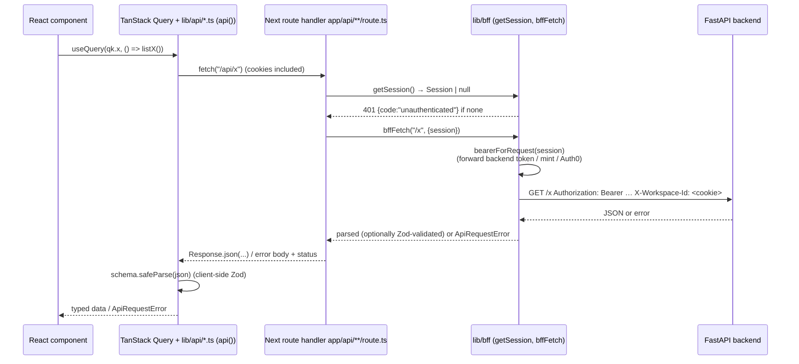
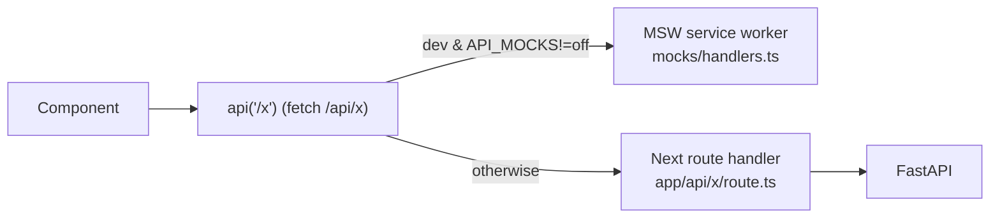
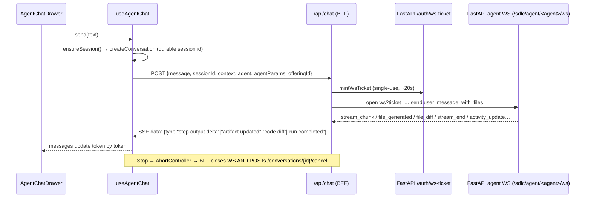
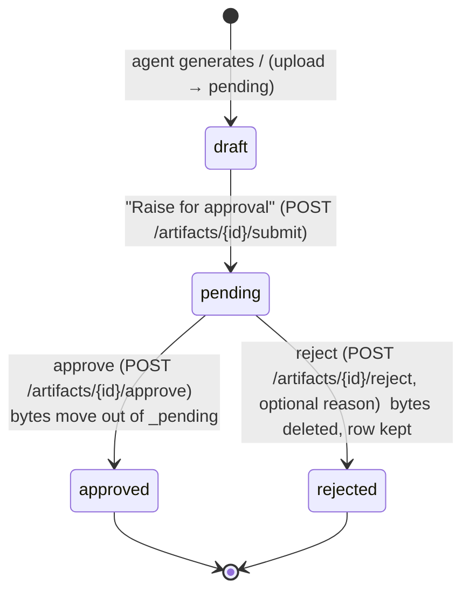

# Frontend Knowledge-Transfer Report

> **Scope:** everything under `frontend/` (package name `@sdlc/web`).
> **Written from the code as of branch `stabilization` (commit `ad95ed28`).** Every path, function and behaviour below was read in the source; where something could not be confirmed it is marked **⚠ unverified**.
> **How to use this:** sections 1–3 orient you, 4–6 are the architecture that everything else hangs on, 7 walks the real features, 8–9 cover components and tests, 10 is the cookbook + gotchas, 11 is the glossary and a "where do I look" table.

---

## Table of contents

1. [Overview and tech stack](#1-overview-and-tech-stack)
2. [Directory map](#2-directory-map)
3. [Routing](#3-routing)
4. [Auth and RBAC on the frontend](#4-auth-and-rbac-on-the-frontend)
5. [Data layer](#5-data-layer)
6. [State management](#6-state-management)
7. [Core feature walkthroughs](#7-core-feature-walkthroughs)
8. [Component architecture](#8-component-architecture)
9. [Testing](#9-testing)
10. [Conventions, gotchas and cookbook](#10-conventions-gotchas-and-cookbook)
11. [Glossary and "where do I look when X breaks"](#11-glossary-and-where-do-i-look-when-x-breaks)
12. [Things this report could not verify](#12-things-this-report-could-not-verify)

---

## 1. Overview and tech stack

### 1.1 What the frontend is

A **Next.js 15 App Router** application, the web UI of an *agentic SDLC platform*: AI agents (Requirements, Design, Project Manager, Development, Code Review, Security, Testing, Deployment, Documentation, plus Track-specific ones) that produce documents, with **human approval gates**, role-based access, budgets, audit and traces.

The browser **never talks to the FastAPI backend directly**. It calls `/api/...`, served by Next route handlers (the **BFF**, *backend-for-frontend*), which forward to FastAPI with a bearer token the browser never sees. This is the single most important structural fact in the codebase (see §3.4 and §5).

### 1.2 Stack (from `frontend/package.json`)

| Concern | Choice | Version |
|---|---|---|
| Framework | Next.js (App Router, Turbopack dev) | `15.1.11` |
| UI runtime | React | `19.0.1` |
| Language | TypeScript, `strict` + `noUncheckedIndexedAccess` | `^5.7.3` |
| Styling | Tailwind CSS v4 (CSS-first `@theme`, OKLCH tokens) | `^4.0.0` |
| Component base | shadcn/ui ("new-york", neutral) over Radix primitives | Radix `^1.x/^2.x` per package |
| Server state | TanStack Query | `^5.62.8` |
| Tables / virtual lists | TanStack Table, TanStack Virtual | `^8.20.6`, `^3.10.9` |
| Client state | Zustand (with `persist`) | `^5.0.12` |
| Validation | Zod | `^3.24.1` |
| Forms | react-hook-form + `@hookform/resolvers` | `^7.54.2` |
| Auth (optional) | `@auth0/nextjs-auth0` (dormant) and `jose` (JWT verify/sign) | `^4.0.1`, `^6.0.0` |
| Mock network | MSW | `^2.7.0` |
| Unit/component tests | Vitest 3 + Testing Library + jsdom | `^3.0.0`, `^16.3.2`, `^29.1.1` |
| E2E | Playwright (+ axe a11y) | `^1.49.1` |
| Component catalogue | Storybook 8 | `^8.6.18` |
| Editors / viz | Monaco, Mermaid, highlight.js, react-markdown, `diff` | see package.json |
| Toasts / icons / motion | Sonner, Lucide, `motion` | see package.json |
| Package manager | **pnpm 9.15.2**, Node `>=20.11` | `packageManager` field |

> ⚠ `frontend/README.md` is **stale**: it describes an early "Chunks 1–18" build, says fonts are Inter/JetBrains Mono, says CSP "is intentionally not set yet", and tells you to `cd apps/web`. The code says otherwise (see §10.2). Trust the code.

### 1.3 Scripts (`package.json`)

| Script | Does |
|---|---|
| `dev` / `dev:turbo` | `next dev --turbo` (port 3000) |
| `build` / `start` | production build / serve (`output: "standalone"`) |
| `typecheck` | `tsc --noEmit` |
| `lint` / `lint:fix` | ESLint 9 flat config, `--max-warnings=0` |
| `format` / `format:check` | Prettier (+ tailwind plugin) |
| `test` / `test:watch` | Vitest |
| `e2e`, `e2e:headed`, `e2e:ui`, `e2e:real-api` | Playwright |
| `storybook` / `build-storybook` | Storybook on `:6006` |
| `msw:init` | writes `public/mockServiceWorker.js` (already committed) |
| `analyze` | `ANALYZE=true next build` (bundle analyzer) |

`npm run dev` also works (used in practice); the repo's lockfile is `pnpm-lock.yaml`.

### 1.4 Environment variables

**Client-visible (`NEXT_PUBLIC_*`, inlined into the bundle at BUILD time — a ConfigMap cannot change them later, see `Dockerfile`):**

| Var | Meaning | Read in |
|---|---|---|
| `NEXT_PUBLIC_AUTH_MODE` | `mock` \| `local` \| `auth0` (anything else → `mock`) | `lib/auth/mode.ts`, `middleware.ts` |
| `NEXT_PUBLIC_API_MOCKS` | `off` disables MSW; anything else leaves it on **in development** | only `components/mocks/msw-init.tsx` |
| `NEXT_PUBLIC_API_BASE` | client API prefix, default `/api` | `lib/api/client.ts` (`API_BASE`) |
| `NEXT_PUBLIC_ENABLE_OIDC` | `true` shows Auth0 SSO UI; mirror of backend `ENABLE_OIDC` | `lib/auth/mode.ts` |
| `NEXT_PUBLIC_DISABLE_STREAMS` | `1` disables SSE subscribers (used by tests) | `stream-subscriber.tsx`, `run-conversation.tsx` |
| `NEXT_PUBLIC_MOCK_LATENCY_MS` | simulated MSW latency (default 120 ms) | `mocks/handlers.ts` |

**Server-only (never `NEXT_PUBLIC_`):**

| Var | Meaning |
|---|---|
| `FASTAPI_INTERNAL_URL` | where the BFF reaches FastAPI. Default in `.env.example` is `http://127.0.0.1:8001` (literal IP: FastAPI binds IPv4 only, `localhost` costs ~200 ms on Node trying `::1` first). Code fallback is `http://localhost:8001`. |
| `JWT_SECRET_KEY` | shared HS256 secret; **must match** the backend's. Verifies backend tokens (`lib/auth/token.ts`); in mock mode also signs BFF tokens (`lib/bff/jwt.ts`). |
| `AUTH0_*`, `APP_BASE_URL` | only when `AUTH_MODE=auth0` |

**Files:** `.env.example` (documented defaults: mock auth, MSW on), `.env.local.example` (real-mode template), `.env.local` (git-ignored, your machine). On the current machine `.env.local` sets `NEXT_PUBLIC_AUTH_MODE=local`, `NEXT_PUBLIC_API_MOCKS=off`, `FASTAPI_INTERNAL_URL=http://localhost:8001`, `NEXT_PUBLIC_ENABLE_OIDC=false` — i.e. **real backend, email+password login, no mocks**.

### 1.5 How to run / test / build

```bash
cd frontend
pnpm install            # or npm install
pnpm dev                # http://localhost:3000
```

* **Frontend-only (no backend):** `NEXT_PUBLIC_AUTH_MODE=mock` and leave `NEXT_PUBLIC_API_MOCKS` unset. You get a role-picker login and MSW fixture data.
* **Against the real backend:** `NEXT_PUBLIC_AUTH_MODE=local`, `NEXT_PUBLIC_API_MOCKS=off`, backend on `:8001`, matching `JWT_SECRET_KEY`. Log in with real seeded accounts (see the repo-root `DEV_LOGINS.txt`).
* Checks before pushing: `pnpm typecheck && pnpm lint && pnpm test`.
* Production image: `Dockerfile` (node:20-alpine, 3 stages, standalone output, non-root). Deploy flow (AKS + ADO + ArgoCD) is in `frontend/DEPLOY.md` and `frontend/argocd/`, `frontend/Manifest/`. Note the Dockerfile's build-arg defaults are `AUTH_MODE=mock`, `API_MOCKS=enabled`.

---

## 2. Directory map

Roughly 870 tracked `.ts/.tsx` files (~130k lines including tests).

```
frontend/
├─ app/                  Next App Router: pages, layouts, and app/api/** (the BFF)
│  ├─ layout.tsx         root layout: 3 vendored fonts, <Providers>
│  ├─ page.tsx           public landing ("/")
│  ├─ globals.css        Tailwind v4 import + design tokens (light/dark)
│  ├─ (auth)/            public: login, forgot-password, reset-password
│  ├─ (app)/             authenticated app (layout builds the session + AppShell)
│  └─ api/               ~206 route.ts files — every browser→backend call passes here
├─ components/
│  ├─ ui/                shadcn primitives + house composites (StatusBadge, EmptyState…)
│  ├─ app/               ~140 app-level components (shell, drawers, dialogs, panels)
│  ├─ orchestrator/      the Orchestrator cockpit (thread, rail, artifacts panel…)
│  ├─ modernization/     Track 3 (Code Modernization) agent pages + viewers
│  ├─ requests/          governance "Requests" lane (raise/detail/table/timeline)
│  ├─ agent-studio/      Agent Studio editor
│  ├─ catalogue/         Agent Catalogue portal
│  ├─ auth/              SessionProvider, RequireRole, RestrictedAccess, scope empty states
│  ├─ landing/           marketing landing + login dialog/sign-in content
│  ├─ runs/, feedback/, brand/, mocks/ (MswInit)
│  └─ providers.tsx      Theme + QueryClient + Tooltip + Sonner
├─ hooks/                use-agent-chat, use-session, use-can, use-access-scope, approval hooks…
├─ lib/
│  ├─ api/               typed client (`client.ts`) + one file per resource, `query-keys.ts`
│  ├─ schemas/           Zod schemas = the wire contract, branded IDs, enums
│  ├─ auth/              session, token, mode, permissions, effective-role, mock/local builders
│  ├─ bff/               SERVER-ONLY: bffFetch, bffProxy, forward, jwt mint, ws-ticket, ws→sse
│  ├─ orchestrator/      protocol (Zod event union), socket hook, stages/types/artifacts
│  ├─ mock/              fixture stores used by MSW handlers
│  ├─ stream/            SSE hooks
│  ├─ roles.ts agents.ts tracks.ts nav.ts governance.ts scope.ts agent-access.ts …
├─ stores/               Zustand: ui-store, workspace-store, orchestrator-store
├─ mocks/                MSW: handlers.ts (~2.4k lines), browser.ts, node.ts, fixtures, sse, chat
├─ middleware.ts         auth guard (Edge runtime)
├─ e2e/                  Playwright specs + helpers.ts
├─ __tests__/            Vitest specs grouped by area (api, app, auth, bff, hooks, lib, nav…)
├─ stories/, .storybook/ Storybook
├─ public/               mockServiceWorker.js, brand logos
├─ next.config.ts        CSP + security headers, standalone output
├─ vitest.config.ts, playwright.config.ts, playwright.live.config.ts
├─ Dockerfile, DEPLOY.md, argocd/, Manifest/, infra.sh
└─ components.json       shadcn CLI config (aliases @/components, @/lib, @/hooks)
```

**Leftovers you will notice (not part of the app):** `apps/web/public/brand/*` (an old monorepo path; the live assets are in `public/brand/`), `uicheck.png` (tracked), `frontend_*.log` files (local dev logs, untracked), and **empty** directories `app/platform/{orgs,users}/` and `components/platform/` — the "platform tier" was removed (see the note on `Session.tier` in `lib/auth/types.ts`).

**Path alias:** `@/*` → repo `frontend/` root (`tsconfig.json`). All imports use `@/lib/...`, `@/components/...`.

---

## 3. Routing

### 3.1 Route groups and layouts

| Group / file | Purpose |
|---|---|
| `app/layout.tsx` | root: loads three self-hosted fonts (`--font-display` Bricolage Grotesque, `--font-sans` Hanken Grotesk, `--font-mono` JetBrains Mono, vendored in `app/fonts/` so dev does not need network), wraps everything in `<Providers>` |
| `app/page.tsx` | public landing (`components/landing/landing.tsx`); if signed in, links to `/dashboard` (or `/my-access` if the session has zero permissions) |
| `app/(auth)/…` | `login`, `forgot-password`, `reset-password` (public) |
| `app/(app)/layout.tsx` | **server component**: `getSession()`; no session → `redirect("/login")`; otherwise `<SessionProvider value={session}><MswInit><AppShell>…` |
| `app/(app)/error.tsx`, `app/global-error.tsx`, `app/not-found.tsx` | error boundaries |
| `app/(app)/projects/[id]/layout.tsx` | **client** layout: fetches the project (`qk.projects.detail`), renders the project header (name, track badge, agent count) and `ProjectTabs`; every project sub-page inherits it |

`AppShell` (`components/app/app-shell.tsx`) = fixed `Sidebar` (desktop) + sticky `TopBar` (breadcrumbs, search trigger, **NotificationsBell**, theme toggle, user menu) + scrollable `<main id="main">` + global `CommandPalette` + `StreamSubscriber` (workspace SSE) + `OfflineBanner`.

### 3.2 Page inventory (`app/**/page.tsx`)

**Global (`app/(app)/…`):** `dashboard`, `projects`, `projects/[id]`, `approvals` (Requests & Approvals), `orchestrator`, `agent-studio`, `catalogue`, `cost`, `integrations` (+ `[kind]`), `activity` (redirects to the right tab of `traces`/`audit`), `audit`, `traces` (+ `[id]`), `runs` (+ `[id]`, `[id]/conversation`), `users` (+ `[id]`), `workspaces` (Business Units, + `[id]`), `my-access`, `profile`, `settings`, `onboarding`, `playground`, and `admin/{access, access/roles, agent-import-sources, audit, mcp, models, models/[provider], roles}` (several of these are thin redirects — e.g. `admin/access/page.tsx` says role assignment moved to Users).

**Per-project (`app/(app)/projects/[id]/…`):** one folder per agent, plus management pages:

| Folder | What it is |
|---|---|
| `requirements`, `design`, `development`, `code-review`, `security`, `testing`, `deployment`, `documentation` | bespoke agent pages (400–850 lines each) |
| `plan` (Project Manager), `strategy`, `migration-mapping`, `validation`, `data-engineering` | thin pages that render `StageWorkbench` (~20 lines) |
| `requirements-modernization`, `discovery` | Track 3 pages built on `Track3AgentPage` |
| `review` | **redirects** to `code-review` (kept so old links work) |
| `orchestrator` | the Orchestrator cockpit locked to this project |
| `approvals`, `capabilities`, `cost`, `integrations`, `members`, `models`, `settings`, `workstreams` | project management pages |

Route segment ≠ phase id in 4 cases (`lib/agents.ts::phaseRoute`): `review`→`code-review`, `requirements_modernization`→`requirements-modernization`, `migration_mapping`→`migration-mapping`, `data_engineering`→`data-engineering`. Use `phaseHref(projectId, phase)`, never hand-build the URL.

### 3.3 Middleware (`middleware.ts`, Edge runtime)

Runs on every request except static assets. Logic, in order:

1. `auth0` mode: `/auth/*` is handed to the Auth0 SDK middleware (dynamic import so mock-mode devs need no `AUTH0_*`).
2. `/` is public.
3. Public prefixes: `/login`, `/forgot-password`, `/reset-password`, `/api/auth`, `/_next`, `/favicon.ico`. (`/reset-password` is load-bearing: an onboarded account has no password until the emailed link is used, so the person arriving is unauthenticated.)
4. `auth0` mode: Auth0 middleware decides.
5. **`local` mode:** the `sdlc_token` cookie must *verify* (`verifyBackendToken`, signature + expiry), not merely exist — the presence check was half of an audited bypass (`docs/rbac-audit-2026-08-17.md`).
6. **`mock` mode:** just checks the `sdlc_session` cookie exists (acceptable only because mock mode cannot reach a real backend).
7. Fail → redirect to `/login?from=<path>`.

The middleware only answers "is there an authenticated caller". *What they may do* is decided downstream (§4.5).

### 3.4 The BFF layer — `app/api/**`

~206 `route.ts` files. Their job: **authenticate the caller, attach the right bearer token, forward to FastAPI, normalise errors.**



Three handler styles (all in `lib/bff/`):

| Helper | File | Use |
|---|---|---|
| `bffProxy(path, {method, body, schema})` | `lib/bff/proxy.ts` | pass-through; **passes backend status through** instead of letting Next render a generic 500; normalises a *bare* 403 to `{code:"forbidden", message:"You don't have access to this at your current role…"}` but keeps an *explained* 403's own words (`ApiRequestError.explained`). Example: `app/api/notifications/route.ts`. |
| `forward(req, path, {method, withBody, withQuery})` | `lib/bff/forward.ts` | enumerated one-to-one proxy. **Query strings are opt-in** (`withQuery`) so a route cannot be used to reach filters it never meant to expose. Deliberately *not* a catch-all. |
| hand-written with `getSession()` + `bffFetch()` | e.g. `app/api/artifacts/[id]/submit|approve/route.ts` | when a route needs custom logic. Comment there: "Forwards rather than authorises" — the backend is the authority. |

Other BFF pieces:

* **`lib/bff/client.ts`** — `bffFetch` (Zod-validate response, throw `ApiRequestError`, add `X-Workspace-Id` from the `sdlc_active_workspace` cookie) and `bearerForRequest` (§4.3).
* **`lib/bff/ws-ticket.ts`** — `mintWsTicket` gets a **single-use 20 s Redis ticket** from `POST {FASTAPI}/auth/ws-ticket`; `fastapiWsUrl()` turns `http(s)` into `ws(s)`.
* **`lib/bff/ws-to-sse.ts`** — `mapWsToSseEvent` converts raw agent WebSocket frames into Zod-valid `StreamEvent`s; **unknown frame types are dropped** (security note T-M4-14) so the backend cannot inject arbitrary payloads into the browser.
* **`lib/bff/not-implemented.ts`** — `notImplemented(endpoint)` (501) and `emptyList()`. Used to be the fake-data seam; only one route still calls it (`app/api/workspaces/[id]/admin/route.ts`, POST). Rule stated in the file: reads return *empty*, writes return *501* — never fabricated data.
* Special routes: `app/api/chat/route.ts` (SSE bridge, §7.1), `app/api/orchestrator/ws-ticket/route.ts`, `app/api/runs/[id]/stream` (per-run SSE relay), `app/api/stream/route.ts` (org-wide SSE — currently **open and quiet**: it heartbeats every 15 s and sends no events; a comment explains it used to synthesise fake events).

**Guard test:** `__tests__/bff/every-api-path-has-a-proxy.test.ts` walks `lib/api/*.ts`, extracts every `api("/…")` path and asserts a matching `route.ts` exists. It exists because an artifact-version panel once shipped with every backend test green while the browser got Next's own 404 (the BFF handler was simply missing).

---

## 4. Auth and RBAC on the frontend

> **Golden rule (repeated in many file headers):** client-side gating is **UX, not security.** The backend re-checks every action. Hiding a button is a courtesy; the 403 behind it is the rule.

### 4.1 Three auth modes (`lib/auth/mode.ts`)

| Mode | Set by | Session comes from | Used for |
|---|---|---|---|
| `mock` (default in code/`.env.example`) | `NEXT_PUBLIC_AUTH_MODE=mock` or unset | `sdlc_session` cookie **is** the session (`lib/auth/mock.ts`) | UI work with no backend; role-picker sign-in |
| `local` | `=local` | signature-verified backend JWT in `sdlc_token` (+ display cookie) | real email+password against FastAPI `POST /auth/login` |
| `auth0` | `=auth0` (+ `ENABLE_OIDC`) | Auth0 session → `GET /auth/permissions` | enterprise SSO (dormant) |

### 4.2 Cookies

| Cookie | Content | Notes |
|---|---|---|
| `sdlc_token` | backend-issued HS256 JWT (`sub`, `tenant_id`, `permissions`, `exp`, optional `platform_role`) | **httpOnly**; lifetime taken from the token's own `exp` (`tokenCookieOptions`); local mode only |
| `sdlc_session` | base64 JSON of a `Session` — **display fields only** in local mode | httpOnly in local mode; **readable** in mock mode because MSW (a service worker) can only see cookies via `document.cookie` |
| `sdlc_active_workspace` | active Business Unit id | written by `stores/workspace-store.ts`; the BFF turns it into the `X-Workspace-Id` header |

### 4.3 The security fix everything is built around

Before the audit (`docs/rbac-audit-2026-08-17.md`, finding 1) the frontend threw away the backend's JWT, stored an *unsigned* session blob, and `lib/bff/jwt.ts` **re-signed that blob's `permissions`** into the token FastAPI trusts — so editing one cookie granted `admin:*`. The fix, now enforced in code:

* **The backend is the only issuer.** `getSession()` (`lib/auth/session.ts`) in local mode reads identity, tenant and permissions from `verifyBackendToken(sdlc_token)` and **ignores** what the display cookie claims about them. The display cookie may set a name/email/avatar — worst case a wrong avatar.
* `bearerForRequest(session)` (`lib/bff/client.ts`):
  * OIDC on and not mock → forward the Auth0 RS256 access token;
  * **local → forward the `sdlc_token` cookie's token; if absent, throw 401 (fail closed — never re-mint)**;
  * mock, or auth0 with OIDC off → `mintBffToken(session)` (only legitimate because those sessions are built server-side).
* `mintBffToken` **throws in local mode** and throws if `JWT_SECRET_KEY` is unset (60-minute tokens).
* On login (`app/api/auth/login/route.ts`) the returned token is verified *before* it is stored; a token the frontend cannot verify (mismatched `JWT_SECRET_KEY`) fails the sign-in loudly.

### 4.4 Roles, permissions, and "who am I acting as"

Two separate vocabularies coexist — do not confuse them:

1. **Coarse legacy role** `Role = "admin" | "member" | "viewer"` (`lib/auth/types.ts`). Drives `useCan`/`RequireRole` and the `Capability` matrix in `lib/auth/capabilities.ts`. In local mode it is *derived from permissions* (`deriveRole` in `lib/auth/local.ts`), never read from a cookie.
2. **Platform roles** `PlatformRole` (`lib/roles.ts`) — the product's RBAC model (PRD §33.1): `org_admin`, `bu_admin`, `contributor`, `project_admin`, `ba`, `architect`, `developer`, `qa`, `security_engineer`, `devops_engineer`, `data_engineer`, `scrum_master`, `custom`. (Comments say "twelve roles"; the union has 13 members because `contributor` — an onboarding placeholder — was added. The mock login picker offers 12.) `ROLE_META` gives each a label, scope (`organization|business_unit|project|configurable`), tier (`governance|delivery`) and PRD section.
3. **Permission strings** like `artifact:view`, `run:create`, `approve`, `artifact:approve_design`, `member:manage`, `admin:*` (wildcard). `hasPermission(session, perm)` (`lib/auth/permissions.ts`) mirrors the backend exactly: `perms.includes(perm) || perms.includes("admin:*")`, fail-closed for null/empty sessions. The authoritative grantable list is `lib/auth/permission-catalog.ts`; `Permission` in `types.ts` is a *hand-maintained subset* (its own comment says so).

**`effectivePlatformRole(session)`** (`lib/auth/effective-role.ts`) decides which platform role to *present*: (1) trust `session.platformRole` (a signed token claim, when present); otherwise (2) **infer from permissions** (e.g. `admin:*`/`settings:manage`→org_admin; `role:manage`/`workspace:manage`→bu_admin; `member:manage`→project_admin; `artifact:approve_requirements`→ba; …). It is presentation only. `dashboardScope`/`dashboardVariant` derive the dashboard shape from it.

**Separation of duties (PRD §14.5/14.6), encoded in `lib/roles.ts`:**
* Governance tier (`org_admin`, `bu_admin`) has **no agent access** (`AGENT_OWNERSHIP` = all `none`).
* `project_admin` is `ALL_OWNER` — fallback approver on every agent (`FALLBACK_APPROVER`).
* Delivery roles each **own exactly one or two agents** ("one agent, one role"): BA → `requirements`, `documentation`, `requirements_modernization`, `discovery`; Architect → `design`, `review`, `strategy`, `migration_mapping`; Developer → `development`; QA → `testing`, `validation`; Security Eng → `security`; DevOps → `deployment`; Data Eng → `data_engineering`; Scrum Master → `plan`.
* `AGENT_OWNER_ROLE[phase]` = the role whose sign-off a gate routes to (approvals go *sideways* to the owner, never up to governance). `canUseAgent` / `canApproveAgent` are the helpers.
* Extra per-person agent access is a *deliberate grant* (`agent_access_overrides`, backend), surfaced via `getMyAgentAccess` and used by `tileStateFor` (`lib/agent-access.ts`).

```mermaid
flowchart TD
    A[Browser request] --> M{middleware.ts}
    M -- no verified session --> L[/login?from=…/]
    M -- ok --> LY[(app)/layout.tsx: getSession]
    LY -- null --> L
    LY --> SP[SessionProvider]
    SP --> H1[useSession / useCan / hasPermission]
    H1 --> UI[Render or hide controls]
    UI --> C[User clicks → api call → BFF]
    C --> BE{Backend re-checks permission + scope}
    BE -- deny --> E403[403 → bffProxy normalises → ApiErrorState]
    BE -- allow --> OK[200]
```

### 4.5 How the UI gates things (the toolkit)

| Tool | File | Use |
|---|---|---|
| `useSession()` / `useSession({required:true})` | `hooks/use-session.ts` | read the `Session` (context from `SessionProvider`) |
| `useCan(capability)` | `hooks/use-can.ts` | legacy coarse capability check |
| `<RequireRole role|capability>` | `components/auth/require-role.tsx` | render children only if allowed (else `fallback`) |
| `hasPermission(session, "x:y")` | `lib/auth/permissions.ts` | fine-grained gate (most new code) |
| `approvePermissionForPhase(phase)` | `lib/auth/permissions.ts` | phase → `artifact:approve_<backend stage>`; unmapped phases return a never-granted sentinel (fail closed). Note `review`→`artifact:approve_code_review`. |
| `canCreateProject(role)` | `lib/auth/permissions.ts` | **role check, not permission** — Org Admin holds `admin:*` but must not create projects (only `bu_admin`/`project_admin`) |
| `canUseOrchestrator(role)` | `lib/orchestrator/access.ts` | only `project_admin` |
| `visibleNav(perms, ctx)` etc. | `lib/nav.ts` | sidebar filtered by permission, platform role, scope (`requireScope: organization|business_unit`). A `contributor` sees **no** working nav (no job yet) |
| `useAccessScope()` | `hooks/use-access-scope.ts` | *which* Business Units/projects the viewer may see (`GET /auth/access-scope`); three states (loading/error/ready) never collapsed into "you have nothing" |
| `<RestrictedAccess>`, `<OutOfScope>` | `components/auth/` | permission/scope empty states |
| `tileStateFor(role, phase, track, built, reach)` | `lib/agent-access.ts` | agent tile state: `owner`\|`use`\|`locked`\|`coming_soon` |

`SessionProvider` (`components/auth/session-provider.tsx`) also runs **`useTokenRefresh`**: once per mount it `POST`s `/api/auth/refresh`; on a `200` it calls `router.refresh()` so a role granted mid-session shows up in nav/role chip (which read the token claim) — a `204` means nothing to do. It never signs anyone out on failure.

### 4.6 Tracks and agent rosters

`lib/tracks.ts` is the single source of truth. Five `DeliveryTrack`s (`TRACK_ORDER`): `greenfield` (T1), `enhancement` (T2), `modernization` (**T3, Code Modernization**), `rpa_infra` (T4), `data_engineering` (T5). `TRACK_META` gives number/label/summary/PRD section.

`agentsForTrack(track)` (hand-off order):

| Track | Roster (`Phase` ids) |
|---|---|
| greenfield, enhancement | requirements, design, plan, development, review, security, testing, deployment, documentation (9) |
| **modernization (T3)** | requirements_modernization, discovery, design, strategy, development, review, security, testing, deployment, documentation (10) |
| rpa_infra | requirements, discovery, migration_mapping, development, security, validation, deployment, documentation (8) |
| data_engineering | requirements, data_engineering, security, testing, deployment, documentation (6) |

Presentation of an agent lives in `lib/agents.ts`: `PHASE_ORDER` (the 9 greenfield stages), `PHASE_ALL` (all 15), `PHASE_LABEL` (note **`plan` is shown as "Project Manager"; `requirements_modernization` as "Migration Intent"; `discovery` as "Dependency and Risk"**), `PHASE_DESCRIPTION`, `GATE_POLICY` (per phase: gate type, capability class, owner label, copy, `mandatory` — `security` and `deployment` are mandatory, `documentation` is `auto_approve`), `BUILT_AGENTS`, `BUILT_AGENTS_BY_TRACK`, `ROUTABLE_PHASES`, `phaseRoute`, `phaseHref`, `chatAgentPhase`, `chatSessionHref`.

**"Built" vs "in roster":** a phase can be in a track's roster and still render as *Coming soon*. `BUILT_AGENTS_BY_TRACK.modernization` is only `["requirements_modernization","discovery"]` — Track 3's own agents; its `design`, `development`, etc. stay "Coming soon" even though Track 1 agents with the same names are built, because each track owns its own agents. Tracks 4/5 reuse `BUILT_AGENTS`.

---

## 5. Data layer

### 5.1 The client: `lib/api/client.ts`

`api(path, {method, body, query, schema, signal, headers})`:
* prefixes `API_BASE` (`/api`), sends JSON with `credentials: "include"`;
* non-OK → `throw new ApiRequestError(status, body, statusText)`;
* `204` → `undefined`;
* with a `schema`, `safeParse`s the response; a mismatch throws `ApiRequestError(500, {code:"schema_mismatch"})` and logs the Zod issues to the console.

`ApiRequestError` fields: `status`, `code`, `requestId?`, `details?`, `rawBody`, `explained`. It understands FastAPI's `{detail: "msg"}` and `{detail: {code, message}}` shapes, and derives a code from the HTTP status when the backend named none (`codeForStatus`: 400 bad_request, 401 unauthorized, 403 forbidden, 404 not_found, 409 conflict, 422 invalid_request, 429 rate_limited, 5xx server_error). `explained` = "the backend named a code itself" — use it rather than comparing `code` to a sentinel.

There are ~40 resource modules in `lib/api/` (`projects.ts`, `artifacts.ts`, `artifact-versions.ts`, `approvals.ts`, `notifications.ts`, `conversations.ts`, `models.ts`, `modernization.ts`, `governance-approvals.ts`, `users.ts`, `workspaces.ts`, `cost.ts`, …). Convention: small typed functions returning `api(...)` with a Zod schema, no React.

### 5.2 Schemas: `lib/schemas/*`

The Zod schemas **are** the wire contract; `lib/schemas/index.ts` re-exports them. Highlights:
* `ids.ts` — **branded IDs** (`ProjectId`, `RunId`, `ArtifactId`, `NotificationId`…): plain strings at runtime, distinct types at compile time.
* `enums.ts` — `Role`, `Status`, `AgentType`, `Phase` (15 values), `DeliveryTrack`, `CapabilityClass`.
* `artifact.ts`, `approval.ts`, `governance-approval.ts`, `notification.ts`, `project.ts`, `modernization.ts`, `stream.ts`, …

**Critical consequence:** the Zod enums are *strict*. If the backend sends a value the enum does not list, that row fails validation. This is exactly why adding the three `document_*` notification kinds required editing `lib/schemas/notification.ts` (a failed parse makes the whole bell show "Couldn't load notifications"). Extra unknown *keys* are stripped, unknown enum *values* are rejected.

### 5.3 Query keys: `lib/api/query-keys.ts`

One factory object `qk` (`qk.projects.detail(id)`, `qk.artifacts.forProject(id)`, `qk.notifications.list()`, `qk.conversations.list(projectId, agent)`, `qk.artifactVersions.forStage(id, phase)`, `qk.myAgentAccess.forProject(id)`, `qk.approvals.list({})`, `qk.model.options(projectId)`, …). Always build keys through `qk` so bulk invalidation (`invalidateQueries({queryKey: qk.projects.all()})`) works and keys cannot drift.

### 5.4 TanStack Query patterns

Defaults (`components/providers.tsx`): `staleTime` 30 s, `refetchOnWindowFocus: false`, queries retry twice **except on 4xx**, mutations never retry.

Typical patterns you will see:
* **Query:** `useQuery({ queryKey: qk…, queryFn: () => apiFn(...), enabled?, staleTime? })`.
* **Mutation + invalidate:** `useMutation({ mutationFn, onSuccess: () => { toast.success(…); queryClient.invalidateQueries({queryKey: qk…}) } })` — see `hooks/use-raise-for-approval.ts`, `hooks/use-artifact-approval.ts`.
* **Optimistic update with rollback:** `NotificationsBell` `markRead` writes `readAt` into the cache in `onMutate`, keeps `previous`, restores it in `onError`, and refuses to start a second call while one is in flight.
* **Polling:** the bell uses `refetchInterval: 30_000`.
* **Sessions/Access queries** treat *pending* and *error* as distinct from *empty* (a recurring theme: a failed fetch must never read as "nothing here").

### 5.5 Mock layer and the mock/real switch

Two independent switches:

1. **Where the network answers** — MSW (`mocks/`, ~111 handlers in `mocks/handlers.ts`, fixtures in `mocks/fixtures.ts` and `lib/mock/*`).
   `components/mocks/msw-init.tsx` starts the service worker **only if `NODE_ENV === "development"` and `NEXT_PUBLIC_API_MOCKS !== "off"`**. It blocks first paint until the worker is ready and caches the start promise (StrictMode double-mounts effects; a second `worker.start()` throws). When MSW is active it intercepts the browser's `fetch("/api/...")` **before it reaches Next**, so the BFF is bypassed entirely. In production builds MSW never starts, whatever `NEXT_PUBLIC_API_MOCKS` says.
2. **Who you are** — `NEXT_PUBLIC_AUTH_MODE` (§4.1). Mock auth builds the session from a cookie; real modes need the backend.

Vitest and Storybook use the same handlers (`mocks/node.ts` = `setupServer`, `mocks/browser.ts` = `setupWorker`).



> Keep both in mind when a mock-mode screen "works" but the real one 404s: the missing piece is usually the `app/api/**/route.ts` (or its backend endpoint), which MSW hides.

---

## 6. State management

Rule of thumb in this codebase: **server state → TanStack Query; UI/browser-only state → Zustand or component `useState`.**

| Store | File | Holds | Persisted? |
|---|---|---|---|
| `useUiStore` | `stores/ui-store.ts` | sidebar collapsed/mobile open, command-palette open, SSE `connectionState`, `unreadCount` (bumped by SSE `hitl.pending`) | only `sidebarCollapsed` (`localStorage` key `sdlc.ui`) |
| `useWorkspaceStore` | `stores/workspace-store.ts` | `activeWorkspaceId` (the Business Unit being acted in) | yes (`sdlc.workspace`) **and mirrored into the `sdlc_active_workspace` cookie** so the BFF can forward `X-Workspace-Id`; re-asserted on rehydrate |
| `useOrchestratorStore` | `stores/orchestrator-store.ts` | the *unsent draft* chat session and which rail row is selected | **not persisted** (was localStorage before Phase 5B; transcripts now live server-side) |

Other state lives in: the React Query cache (everything fetched), `SessionProvider` context (the `Session`), component `useState` (dialogs, selected tab/version, model pick), URL search params (e.g. `?session=<id>` deep links via `hooks/use-chat-deep-link.ts`), and `next-themes` (theme class).

Note the bell's unread count is **two sources summed**: `useUiStore.unreadCount` (live SSE bumps) + stored unread rows from the query.

---

## 7. Core feature walkthroughs

### 7.1 Agent chat (standalone agent pages)

**Pieces:** `hooks/use-agent-chat.ts` (state + transport) → `POST /api/chat` (`app/api/chat/route.ts`) → server-side WebSocket to the agent → SSE back → `components/app/agent-chat-drawer.tsx` (UI).



Key facts (all from code comments):
* `agentWsPath()` in `app/api/chat/route.ts` maps agent ids → WS paths (`requirement`/`requirements`→`/sdlc/agent/requirement/ws`, `design`, `plan`, `development`, `code_review`/`code-review`, `security`, `testing`, `deployment`, `documentation`, `requirements_modernization`, `discovery`). **There is no fallback**: an unmapped agent returns `400 unknown_agent` (falling back to another engine would let the wrong agent answer with a plausible reply). Pinned by `app/api/__tests__/chat-agent-map.test.ts`.
* The chat id is `runId` = the `sessionId`; underscores not colons (`chat_<ts>`) because agents use it in filesystem paths and Windows forbids `:`.
* **Stop really stops:** client abort → BFF `onAbort` closes the socket *and* calls `POST /conversations/{sessionId}/cancel` so the agent unwinds instead of continuing to spend tokens.
* If the ws ticket cannot be minted (e.g. backend Redis down → 503) the BFF writes a readable message into the chat stream and a `run.completed` (`failed`).
* `useAgentChat(options)` returns `{ messages, send, cancel, reset, busy, documents, sessions, sessionId, selectSession, newChat, attachments, attachFiles, removeAttachment, sessionsLoading }`. Options include `agent`, `projectId` (turns on durable sessions), `context`, `offeringId`, `sessionKey` (reset conversation when it changes), `onArtifact`, `openSessionId`.
* Durable sessions need **both** `agent` and `projectId` (`sessionsEnabled`). Otherwise the chat is ephemeral.
* Attachments: `attachFiles` ensures a session then `uploadAttachments(sid, files)`; refs ride in `context.attachments` for that turn and are cleared after send.
* `artifact.updated` events add a `GeneratedDocument` to `documents` and call `onArtifact` (pages use it to refetch). `onArtifact` also fires when the turn ends.
* Each agent page passes its own id: requirements→`"requirement"`, design→`"design"`, code review→`"code_review"`, security, testing, deployment, documentation, development; `StageWorkbench` and `Track3AgentPage` take it from props.

**`AgentChatDrawer`** (`components/app/agent-chat-drawer.tsx`, ~800 lines): a resizable `Sheet` (width persisted under `agent-chat-drawer-width`, 400–1100 px, keyboard-resizable), optional **session rail** on the left (shown when `onNewChat` is provided), message bubbles with markdown, tool-call chips, **diff cards** for `code.diff`, attachment chips, slash-command suggestions (`/summarize`, `/critique`, `/edit`, `/explain`), starter suggestion chips, `disabledReason` (composer disabled with a notice), and a Send↔**Stop** button when `onStop` is supplied.
**Header (changed on branch `stabilization`):** the title row is `Agent chat` plus a **prominent pill** (`data-testid="agent-chat-agent-name"`, `text-sm font-semibold`, primary tint) showing `context.page` — the agent's name. The optional `context.artifactTitle` stays as a small outline badge underneath.

### 7.2 The Orchestrator cockpit

Route: global `/orchestrator` and per-project `/projects/[id]/orchestrator` — **one component, two routes** (`components/orchestrator/cockpit.tsx`, `OrchestratorCockpit`, `lockedProjectId`, `variant: "page"|"embedded"`).

* **Project-Admin only** (`lib/orchestrator/access.ts::canUseOrchestrator`; sidebar entry gated by `requirePlatformRole`). Reason in the file: it reaches all agents at once, so it must not be a back door around one-agent-one-role.
* **Not a sequencer.** By default the *engine routes* each message to one of nine agents (or answers itself) and announces every routing decision with its reason in an `agent.selected` event; the user can override per turn with the agent picker. There are no gates/sign-offs and no fixed stage order (PRD §34.11).
* **Transport differs from standalone chat:** the *browser opens the WebSocket itself*. `lib/orchestrator/use-orchestrator-socket.ts` first `POST`s `/api/orchestrator/ws-ticket` (BFF mints the single-use ticket and returns `{ticket, wsUrl}`), then connects to `wsUrl?ticket=…` (`/sdlc/agent/orchestrator2/ws`). The socket itself refuses non-Project-Admins before accepting the handshake. **Every inbound frame goes through `OrchestratorEvent.safeParse`** (`lib/orchestrator/protocol.ts`, a Zod union) and unrecognised frames are dropped.
* **Runs are created lazily** on the first turn (a `runs` row is needed because `run_id` becomes the LangGraph thread id); merely opening the page creates nothing.
* **History is server-side** (`lib/api/conversations`, `listConversations(projectId, "orchestrator")`); a saved chat's id *is* its run id. `SessionRail`, `Thread`, `ProjectPicker`, `ModelPicker`, `ChoiceCard` complete the UI.
* **Right panel — `ArtifactsPanel`** (`components/orchestrator/artifacts-panel.tsx`) with up to **three tabs**: `artifacts` (labelled **"Deliverables"**, what *this run's* agents produced — `orchestrator_deliverables`, no approval concept), `activity` (live action feed), and `project` (labelled "Artifacts", **the project's *approved* documents** from every agent's own page — `ProjectArtifactsTab`, offered only when the run has a `projectId`). The distinction matters: same word "artifact", two tables. (A "Context" tab was removed on 2026-09-07 at the user's request — see the comment in the file.)

### 7.3 Standalone agent pages

Three shapes:

1. **Bespoke pages** — Requirements, Design, Development, Code Review, Security, Testing, Deployment, Documentation (`app/(app)/projects/[id]/<agent>/page.tsx`, 300–850 lines each). Each wires `useAgentChat`, a model selector, a viewer specific to its artifact (story editor, Mermaid, diff/PR viewers, coverage, deploy plan…), the Documents panel, and its access gate.
2. **`StageWorkbench`** (`components/app/stage-workbench.tsx`) — a shared shell for stages that only need list/detail/chat: header (ModelSelector + Run), left artifact list filtered to the phase, detail pane with the approval gate (`GATE_POLICY[phase]`), activity dock, chat. Used by `plan`, `strategy`, `migration-mapping`, `validation`, `data-engineering`. Props: `phase`, `agent`, `title`, `runLabel`, `emptyTitle`, `emptyDescription`.
3. **`Track3AgentPage`** (`components/modernization/track3-agent-page.tsx`) — for Code Modernization's two built agents (`requirements_modernization` = "Migration Intent", `discovery` = "Dependency and Risk"). Layout: header (agent, `ModelSelector`, **Pull legacy code**, **Run agent**), left `VersionHistory` (every recorded brief/assessment is a *frozen version*), centre `HowItWorks` guide until a version is opened (a version recorded *while the page is open* opens automatically), then `VersionView` (renders the payload via the page's `renderVersion`, Word/PDF download, and the **Sign-off** = the stage-version gate). The chat talks to the agent's **own** socket. If the project's track lacks the agent it shows an `EmptyState` instead. Data hooks: `listStageVersions` (`lib/api/artifact-versions.ts`), `useLegacyCode` (`legacy-code-control.tsx`), `Track3Stage` type in `lib/api/modernization.ts`. Each page (`discovery/page.tsx`, `requirements-modernization/page.tsx`) is ~60 lines: it just supplies copy + a `renderVersion` that `safeParse`s the payload (`DiscoveryAssessment`, migration-intent schemas from `lib/schemas/modernization.ts`) and shows an `ErrorState` if the shape is unrecognised.

The project overview (`projects/[id]/page.tsx`) shows the pipeline as tiles with a per-viewer state from `tileStateFor` and `getMyAgentAccess`; until the API answers it falls back to the role's static reach so nothing flashes unlocked.

### 7.4 Documents, artifacts and approvals

**Two artifact shapes — do not conflate:**

| Shape | Table / API | What | Approval |
|---|---|---|---|
| **Blob documents** ("artifacts") | `artifacts`; `lib/api/artifacts.ts` | DOCX/PDF/diagrams etc. produced by agents or uploaded | per-document: `draft → pending → approved/rejected` |
| **Stage payload versions** | `artifact_versions`; `lib/api/artifact-versions.ts` | the JSONB an agent hands to the next agent; frozen, numbered per project+stage (DB trigger) | `draft → published/rejected/superseded` via publish/reject |

Stage names in the versions API are **backend names** (`code_review`, not `review`) — use `toBackendStage`.

**Document lifecycle (blob documents):**



* **Documents panel:** `components/app/document-list.tsx` (approved list, uploader, pending badge naming who it is "waiting on", raise/approve/reject/delete buttons), `document-card.tsx`, `generated-documents.tsx` (documents produced in the current chat).
* **Raise for approval:** `hooks/use-raise-for-approval.ts` — `mayRaise(stage)` is true with `run:create`, else if `getMyAgentAccess().reach[phase] !== "none"` (a project-wide document belongs to no agent → needs `run:create`). `raise(artifact)` → `submitArtifact`; success toasts and invalidates `qk.artifacts.forProject` and `qk.approvals.list({})`.
* **Approve/reject:** `hooks/use-artifact-approval.ts` — `canDecide = hasPermission(session,"approve")`; `approve(id)`/`reject(id)` with `decidingId` for pending UI; invalidates the project's artifact list and the artifact detail.
* **BFF:** `app/api/artifacts/[id]/{submit,approve,reject,download,page,deletion-request}/route.ts` — thin "forward, don't authorise".
* **Who approves (backend rule, restated in `document-list.tsx`):** *two equal approvers* — the stage's owning role **or** a Project Admin; either decides, first one wins, and the row leaves both queues (the queue is *derived* from `approval_status`, not stored per approver). ⚠ A comment in `lib/api/artifacts.ts` still says only "someone who runs the project" can approve; the backend (`_artifact_for_decision`) also allows the stage owner.
* **Delete:** `requestArtifactDeletion` — `204` (you own the agent → deleted) vs `202` (a request was raised); the UI must word each differently.

**Requests & Approvals page** (`app/(app)/approvals/page.tsx`): the personal queue and the place you raise things. Two lanes on one page:
* **Approvals** (`ApprovalQueue`, `ApprovalGateRow`; `listApprovals` → `GET /approvals`): agent gates and **pending documents** (row id `artifact:<id>`, type `document`), routed *sideways* to the owning role, fallback Project Admin.
* **Requests** (`components/requests/*`, `listGovernanceApprovals`): a person needing something (access, budget, project creation, connector, agent access, cross-BU member…), routed *upward* PA → BU admin → Org admin (`lib/requests/routing.ts` `REQUEST_ESCALATION_CHAIN`; type→approver in `lib/governance.ts::GOVERNANCE_APPROVER_ROLE`). Tabs: Inbox / My requests / All. Merging the two lanes is forbidden by design (PRD §33.2 "no approval laundering").

### 7.5 Notifications bell

* **UI:** `components/app/notifications-bell.tsx` (in `TopBar`). `useQuery(qk.notifications.list(), listNotifications, {staleTime 15s, refetchInterval 30s})`; badge = `useUiStore.unreadCount` + unread stored rows; opening the dropdown marks everything read (optimistic, with rollback and an in-flight guard); each row is a `Link` to `n.href` when present, else a plain block; a *failed* fetch shows "Couldn't load notifications" (deliberately not "Nothing yet").
* **API:** `lib/api/notifications.ts` — `listNotifications` = `GET /api/notifications`, `markNotificationsRead` = `POST /api/notifications` (the BFF route maps that to backend `POST /notifications/read`). BFF: `app/api/notifications/route.ts` via `bffProxy`.
* **Schema:** `lib/schemas/notification.ts` — `NotificationKind` enum: `hitl_pending, run_failed, run_completed, budget_near_cap, guardrail_blocked, mention, request_created, request_assigned, request_approval_required, request_approved, request_rejected, request_escalated, member_awaiting_role, project_activated` and, **new on this branch**, `document_approval_required`, `document_approved`, `document_rejected`. `Notification` = `{id, kind, title, body?, projectId?, runId?, href?, readAt|null, createdAt}`.
* **Addressing is server-side and not on the wire:** rows are addressed to a person or to a role-at-scope; the client only sees what is addressed to it (`recipient_*` fields are deliberately absent from the response schema).
* **Document notifications (this branch):** raising a document notifies the project's admins (`document_approval_required`); approving/rejecting notifies whoever raised it (`document_approved` / `document_rejected`, rejection includes the reason). Each carries `href = /projects/<id>/<stage with _→->` (e.g. `/projects/…/code-review`) so a click opens the exact agent page. Backend: `shared/services/artifact_approval.py` (`notify_submitted`, `notify_decided`), migration `0064_document_approval_kinds`. **The frontend needs nothing but the enum entry** — the bell renders any `href`.
* ⚠ Observed (backend, not tested in a browser): the older `artifact_superseded` notification builds its `href` from the raw backend stage (`/projects/<id>/<stage>`), which would be `code_review` (underscore) — but the frontend route is `code-review`. Worth checking if that notice is ever clicked.

### 7.6 Governance requests, projects, members, settings

* **Governance approvals:** `lib/schemas/governance-approval.ts` (type enum: `project_creation`, `model_credential`, `budget_increase`, `project_archive`, `project_settings_change`, `agent_default_*`, `connector_access`, `mcp_server`, `access_request`, `user_onboarding`, `role_assignment`, `cross_bu_assignment`, `model_provider_access`, `agent_access`, `artifact_consumption`, `other`…), `lib/api/governance-approvals.ts`, BFF `app/api/governance-approvals/[id]/{cancel,decide,escalate}`. Some types are **type-routed** (fixed approver) and others **tier-routed** from the requester (`lib/requests/routing.ts`).
* **Projects:** list `/projects`, overview `/projects/[id]` (pipeline tiles, recent chats, cost panel, delivery-status picker for PA/BU/Org), `create-project-dialog.tsx`, members page (grants extra agents), settings page (944 lines; edits raise a `project_settings_change` request for a Project Admin), archive/restore.
* **Users & Roles** (`users/page.tsx`): Org Admin admits people (BU admin vs Contributor); the BU Admin then assigns the actual delivery role — a two-step handover. **Read org-wide, write inside your own unit.**
* **My access** (`my-access/page.tsx`): open to every role, read-only, shows the viewer's own bindings/permissions.
* **Dashboard** (`dashboard/page.tsx`): one screen, four "leads" by role variant (`dashboardVariant`).
* **Agent Studio / Catalogue:** Studio edits agent profiles/skills through the Org→BU→Project→Personal cascade (`components/agent-studio/*`, `lib/api/agent-profiles.ts`, `agent-skills.ts`); Catalogue (`catalogue/page.tsx`) is deliberately *ungated* and derived from `lib/catalogue.ts`.

### 7.7 Models and `ModelSelector`

`components/app/model-selector.tsx` picks an **offering** (a specific provider connection + model) fed by `GET /model/options` (`qk.model.options(projectId)`), grouped by connection so two API keys for the same model stay distinguishable. The chosen `offering_id` flows: page state → `useAgentChat({offeringId})` → `/api/chat` `offeringId` → agent `offering_id`. The component *displays* the org default when there is no explicit choice — the file's comment records a bug where the displayed default and the actually-run default differed, so what is shown must be what runs. Admin side: `admin/models` (providers, verify/probe, grants per org/BU/project) with `lib/api/models.ts`.

### 7.8 Integrations, MCP, cost, audit/traces, onboarding

* **Integrations** (`integrations/page.tsx`, `[kind]`, `components/app/*-dialog.tsx`, `lib/api/connectors.ts`, `mcp.ts`, `integration-access.ts`, per-project `project-integrations.ts`): connectors grouped by purpose (Azure DevOps is one tile for boards+repos+CI); credentials by pasted PAT/token or OAuth; grants cascade Org→BU→project; MCP servers registered via `admin/mcp` and `app/api/mcp/registry`.
* **Cost & Budget** (`cost/page.tsx`, `components/app/cost-dashboard.tsx`, `budget-hub.tsx`, `lib/api/cost.ts`): spend series, budgets, budget-increase requests (governance). Per-project cost gated by `useCanSeeProjectCost`.
* **Activity = Audit + Traces:** `/activity` redirects each viewer to the tab they can open (BU Admin has `audit:view` not `trace:view`; Project Admin the reverse). Audit (`audit/page.tsx`) walks by **cursor**; changing a filter resets the cursor. Traces (`traces/*`, `components/app/traces-explorer.tsx`, `trace-span-tree.tsx`, `open-in-langfuse.tsx`).
* **Onboarding wizard** (`onboarding/page.tsx`, 1,058 lines) and `lib/api/onboarding.ts`.

---

## 8. Component architecture

### 8.1 Layers

1. **`components/ui/`** — shadcn/Radix primitives *owned in-repo* (installed manually, not via CLI): Button, Card, Dialog, Sheet, Drawer (vaul), Popover, Tooltip, DropdownMenu, ContextMenu, Command (cmdk), Select, Tabs, Table, Form (RHF+Zod), Badge, Avatar, ScrollArea, Skeleton, Progress, Switch, Checkbox, RadioGroup… plus **house composites**: `StatusBadge` (canonical statuses — the keys are the shared source of truth with backend schemas), `CostBadge`, `EmptyState`, `ErrorState`, `LoadingState` (**mandatory** for every list/table/chart/editor per the cross-chunk conventions), `DataTable` (TanStack Table wrapper), `sortable-header`, `icon`.
2. **`components/app/`** — app-aware building blocks (shell, dialogs, panels, viewers). These call hooks/API and know about roles.
3. **Feature folders** — `orchestrator/`, `modernization/`, `requests/`, `agent-studio/`, `catalogue/`, `landing/`, `auth/`.
4. **Pages** — `app/**/page.tsx`, compose the above; the big ones are large (many are 500–1,000 lines).

### 8.2 Conventions

* **`cn(...)`** (`lib/utils.ts`) = `twMerge(clsx(...))` — every component accepts `className` and merges through `cn`.
* **`cva`** (class-variance-authority) for variant components (e.g. Button 7 variants × 4 sizes, `asChild` via Radix `Slot`).
* Client components start with `"use client"`; server components are the `(app)` layout, `app/page.tsx`, login page, and BFF route handlers. The sign-in module `sign-in-content.tsx` is *deliberately not* `"use client"` (a server component calls its functions; across a client boundary it would be a serialised reference).
* File naming is kebab-case; component names PascalCase; hooks `use-*.ts`.
* **Lucide** icons; **Sonner** toasts (`toast.success/error`); **date-fns** for relative times.
* Long explanatory comments ("THE BUG THIS CATCHES…") are the house style — read them; they encode why things are the way they are.

### 8.3 Theming and design tokens

* `app/globals.css`: `@import "tailwindcss"` + `tw-animate-css`, `@custom-variant dark (&:is(.dark *))`, tokens in **OKLCH** on `:root` and overridden under `.dark`, wired into Tailwind via `@theme inline`.
* Brand: **PwC orange** primary (`--primary: oklch(0.579 0.172 40.85)`), `--brand-gradient-from/to`, `--brand-bright`; semantic `success/warning/info/destructive`; `--radius: 0.625rem` with `sm/md/lg/xl` derived; chart palette `chart-1..5`; sidebar tokens.
* Dark mode: `next-themes` with `attribute="class"`, `defaultTheme="system"`. Atmosphere utilities `.bg-mesh` and `.grain` are used by `AppShell`.
* Fonts: display Bricolage Grotesque, body Hanken Grotesk, mono JetBrains Mono (vendored under `app/fonts/`).
* Accessibility baseline: `:focus-visible` rings, `prefers-reduced-motion`, skip target `#main`; axe checks in `e2e/a11y.spec.ts`.

### 8.4 Security headers (`next.config.ts`)

CSP (dev variant allows `'unsafe-eval'` + websockets for HMR; prod drops `unsafe-eval`; `connect-src 'self' https://*.auth0.com`; `worker-src blob:` for Monaco), HSTS, `X-Frame-Options: DENY`, `nosniff`, strict referrer policy, Permissions-Policy, `COOP: same-origin`. `Cross-Origin-Resource-Policy` is intentionally omitted (MSW/service-worker). `poweredByHeader: false`, `output: "standalone"`.

---

## 9. Testing

### 9.1 Unit / component tests — Vitest

* Config `vitest.config.ts`: `vite-tsconfig-paths`, `esbuild.jsx: "automatic"` (tsconfig says `preserve`, so without this JSX compiled to classic `React.createElement` and failed with "React is not defined"), **default environment is `node`**, include `**/__tests__/**/*.test.{ts,tsx}`, exclude `e2e`. There is **no global setup file**.
* Component tests opt into the DOM with a first-line `// @vitest-environment jsdom` and import `@testing-library/jest-dom/vitest` themselves, wrap in a `QueryClientProvider`, and stub `ResizeObserver` when needed (see `components/orchestrator/__tests__/project-artifacts-tab.test.tsx`).
* ~134 `*.test.ts(x)` files (66 are `.tsx`). Locations: colocated `__tests__/` folders next to code, plus the top-level `__tests__/` grouped by area:
  * `__tests__/auth` — `has-permission`, `effective-role`, `session-forgery` (regression for the cookie-forgery bypass), `local-session`, `access-scope*`
  * `__tests__/bff` — `client`, `jwt`, `ws-ticket`, `ws-to-sse`, `chat-route-carries-both`, `every-api-path-has-a-proxy`
  * `__tests__/app` — page/component behaviour (document raise-for-approval, deployment/security report approval, agent-chat-drawer, model picker wiring, notification addressing, projects view, request routing…)
  * `__tests__/hooks` — `use-agent-chat`, cancel, model
  * `__tests__/lib` — `tracks`, `track3-agents`, `agent-ownership`, `agent-access`
  * `__tests__/nav` — `visible-nav`, `phase-segments-have-labels`
* Tests that pin *tables that must not drift*: `app/api/__tests__/chat-agent-map.test.ts` (agent → WS path), `__tests__/app/agent-ownership.test.ts` (ownership invariants), `__tests__/nav/phase-segments-have-labels.test.ts` (every agent route has a breadcrumb label), `__tests__/lib/track3-agents.test.ts` (Track 3 roster/built state), `__tests__/bff/every-api-path-has-a-proxy.test.ts`.
* API contract tests use captured real payloads (`__tests__/api/*-real-payload.test.ts`, `__tests__/fixtures/live-deployments.json`).

### 9.2 E2E — Playwright

* `playwright.config.ts`: `testDir ./e2e`. Two projects:
  * **`chromium`** (mock, default): auto-boots `next dev --turbo --port ${E2E_PORT:-3100}` with `AUTH_MODE=mock`, `DISABLE_STREAMS=1`, `MOCK_LATENCY_MS=0`; ignores `stream`, `components-parity` and the BU-admin spec. Note the use of `localhost` not `127.0.0.1` (the mock sign-in POST 303-redirects and `form-action 'self'` would block a host mismatch).
  * **`real-api`**: port `${E2E_REAL_API_PORT:-3101}`, `API_MOCKS=off`, streams on; runs only `stream.spec.ts` and `components-parity.spec.ts`; needs Postgres + Redis, backend on `:8001`, and `scripts/seed_e2e_fixtures.py`.
* `playwright.live.config.ts`: starts nothing; runs `bu-admin-onboarding-and-projects-table.spec.ts` against an already-running `:3000` (real backend, local auth, seeded personas via `python -m scripts.seed_dev_personas`), serial, 1 worker.
* Specs in `e2e/`: `a11y`, `auth`, `golden-path`, `orchestrator`, `users-and-roles`, `model-management`, `integration-governance`, `dialog-scrolling`, `m5-hitl-check`, `stream`, `components-parity`, `bu-admin-onboarding-and-projects-table`.
* **`e2e/helpers.ts::signInAs(page, role)`**: goes to `/login`, **clicks "legacy quick picker"** (the mock panel now defaults to the 12-platform-role picker), checks the radio whose accessible name matches `^<role>\b` (`admin|member|viewer`), clicks "Continue as", then waits until the URL is no longer `/login` (`waitUntil: "commit"` because the 303 redirect chain aborts a "load" wait). `waitForProjects` waits for the "Projects" heading and a fixture project. ⚠ For the 12-role picker, the radios are `id="platform-role-<role>"` with `value=<role>` (`app/(auth)/login/mock-signin-panel.tsx`) — select by `value`, not by label; this helper drives the *legacy* path only.

### 9.3 Storybook

`.storybook/{main,preview}.tsx`, `stories/*.stories.tsx` (Buttons, Inputs, Overlays, Display, DataTable, StatusBadge, States, AgentChat, ApprovalCard, ArtifactList, DiffViewer, Mermaid, OpenApi, PhasePipeline, Timeline, CostAndGuardrails, Comments) with a11y + themes addons; MSW handlers are shared.

---

## 10. Conventions, gotchas and cookbook

### 10.1 Naming traps (these bite everyone once)

| Concept | UI spelling | Backend spelling | Where translated |
|---|---|---|---|
| Code Review stage | `review` (Phase) | `code_review` (stage, permission) | `_PHASE_TO_UI` (backend), many `stage === "code_review" ? "review"` in UI; permission string is the **backend's** (`artifact:approve_code_review`) |
| Requirements chat id | `requirements` (Phase) | chat agent `requirement` | `CHAT_AGENT_PHASE` in `lib/agents.ts`; `agentWsPath` accepts both |
| Route segments | snake_case phase ids | kebab-case URL | `phaseRoute()` / `phaseHref()` |
| Project Manager | label "Project Manager" | key `plan` | key kept (in routes/API), label changed |
| Track 3 Requirements | "Migration Intent" | `requirements_modernization` | its **own** agent, not a mode of `requirements` |

### 10.2 Things in the repo that look wrong but are known

* `README.md` is stale (fonts, CSP, `apps/web`, chunk history). Ignore its "what shipped" sections.
* Comments saying **"13 agents"**/"eight stages" are stale: `Phase` has **15** values, `PHASE_ORDER` has **9**, `PHASE_ALL` all 15.
* Comments saying **"twelve roles"** — `PlatformRole` has 13 members (adds `contributor`).
* `app/api/stream/route.ts` sends **no events** by design (it used to fake them); the workspace SSE is a heartbeat. Real per-run streaming is `app/api/runs/[id]/stream`.
* `admin/access`, `review`, `activity` are **redirect pages** kept for old links.
* Only `app/api/workspaces/[id]/admin/route.ts` still returns `501 not_implemented`.
* Several BFF route comments mention `lib/mock/*` — historical; those routes now proxy the real backend.
* `Session.tier` "platform" survives only for stale cookies; the platform tier was removed.
* Empty dirs `app/platform/*`, `components/platform/` and tracked leftovers `apps/web/public/brand/*`, `uicheck.png`.

### 10.3 Behavioural rules worth remembering

* **Never treat a failed/pending fetch as "empty"** (bell, access scope, workspaces, Documents). Three-state (loading/error/data) is the norm.
* **Gate in UI, enforce in backend.** New gated action = `hasPermission` in the UI + a real permission on the backend route; write a test for the backend refusal.
* **One list, one home.** Rosters (`lib/tracks.ts`), ownership (`lib/roles.ts`), labels (`lib/agents.ts`) are single sources; don't duplicate them in a component. Several `Record<Phase, …>` types make TypeScript force you to update every table when you add a phase.
* **Zod enums are strict** — when the backend adds an enum value, add it here in the same change.
* **`NEXT_PUBLIC_*` are build-time.** Changing them in a running container does nothing.
* **Don't call `getAuth0()` unless OIDC is on and not mock** (it throws on missing `AUTH0_DOMAIN`).
* **Never mint tokens in local mode** — `mintBffToken` throws; use `bearerForRequest`.
* **A route with no BFF handler is a 404 that looks like a backend bug.** Add the `route.ts` (the guard test will tell you).

### 10.4 Cookbook

**A. Add a new field/endpoint call (API)**

1. Backend endpoint exists and is protected.
2. Add/extend the Zod schema in `lib/schemas/<area>.ts` (export via `index.ts`).
3. Add the typed function in `lib/api/<area>.ts` using `api("/path", { schema })`.
4. Add a key in `lib/api/query-keys.ts` if it is a query.
5. Add `app/api/<path>/route.ts` — prefer `bffProxy("/path")` or `forward(req, "/path", {...})`; use a hand-written handler only if you need logic. Forward query strings only with `withQuery: true`.
6. Use it via `useQuery`/`useMutation`; invalidate through `qk`.
7. Add an MSW handler in `mocks/handlers.ts` if mock mode should support it.
8. Run `pnpm test` — `every-api-path-has-a-proxy` will fail if step 5 was missed.

**B. Add a new agent page**

1. `lib/schemas/enums.ts`: add to `Phase` (and `AgentType`).
2. `lib/agents.ts`: `PHASE_LABEL`, `PHASE_DESCRIPTION`, `GATE_POLICY`, `ROUTABLE_PHASES`; add to `PHASE_ALL`; `BUILT_AGENTS` / `BUILT_AGENTS_BY_TRACK` when it is real; extend `phaseRoute()` if the id has an underscore.
3. `lib/tracks.ts`: add to the relevant `TRACK_AGENTS` rosters.
4. `lib/roles.ts`: `ALL_NONE`/`ALL_OWNER`, per-role `AGENT_OWNERSHIP`, and `AGENT_OWNER_ROLE` (TypeScript will complain until you do).
5. `lib/auth/permissions.ts::approvePermissionForPhase`: map to `artifact:approve_<backend stage>` (must exist in the backend vocabulary).
6. `app/(app)/projects/[id]/<route>/page.tsx`: simplest is `StageWorkbench` (`phase`, `agent`, `title`, `runLabel`, empty copy). For a Track 3-style versioned agent, use `Track3AgentPage` (and extend `Track3Stage`/`KIND_FOR_STAGE` in `lib/api/modernization.ts`).
7. `app/api/chat/route.ts::agentWsPath`: add the agent id → `/sdlc/agent/<x>/ws`; update `app/api/__tests__/chat-agent-map.test.ts`.
8. `lib/nav.ts::segmentLabels`: breadcrumb label (test `phase-segments-have-labels` enforces it). Orchestrator id lists (`lib/orchestrator/agents.ts`) if the Orchestrator should reach it.
9. Backend: register the agent, its WS, permissions.
10. Run `__tests__/lib/track3-agents.test.ts`, `agent-ownership.test.ts`, `tracks.test.ts` and fix what they flag.

**C. Add a new notification kind**

1. Backend: add the kind to the DB `CHECK` constraint via a migration (like `0064_document_approval_kinds.py`) **and** emit it via `notifications.emit(...)` with an addressed recipient and an `href`. (`tests/test_db_enums_match_the_code.py` pins the constraint to the emitted kinds.)
2. Frontend: add the literal to `NotificationKind` in `lib/schemas/notification.ts` (otherwise the bell fails to parse the list).
3. Give it an `href` to the exact screen; the bell renders it as a link automatically. Use `phaseHref()`-style paths (kebab-case segments).
4. If it should appear in mock mode, add fixtures in `lib/mock/notification-fixtures.ts`.

**D. Gate a new UI action by permission**

`const session = useSession(); const can = hasPermission(session, "x:y")` → render/disable; pass handlers only when allowed (see `useArtifactApproval`). Ensure the backend route requires the same permission.

**E. Add a new role**

`lib/roles.ts` (`PlatformRole`, `ROLE_META`, `ROLE_ORDER`, ownership rows), `lib/auth/role-permissions.ts` (permission bundle; mock sign-in reads it), `lib/auth/effective-role.ts` inference rules if it has a distinctive permission, plus backend catalogue. Tests in `__tests__/auth` and `__tests__/app/agent-ownership.test.ts`.

---

## 11. Glossary and "where do I look when X breaks"

### 11.1 Glossary

| Term | Meaning |
|---|---|
| **BFF** | Backend-for-frontend: the Next route handlers under `app/api` that forward to FastAPI. |
| **Phase / Stage / Agent** | An SDLC agent id (`requirements`, `design`, …). "Stage" is the backend spelling (`code_review`). |
| **Track** | A delivery template (Greenfield, Enhancement, Modernization=Track 3, RPA & Infra, Data Eng) with its own agent roster. |
| **Platform role** | One of the RBAC roles (`org_admin`, `ba`, …). **Tier**: governance vs delivery. |
| **Business Unit (BU)** / workspace | Org subdivision; the "active workspace" scopes lists. Internally often `workspace`. |
| **Gate / sign-off** | A human approval an agent's output must pass; routed to the owning role (fallback Project Admin). |
| **Approval vs Request** | Approval = agent gate/document, routes sideways; Request = a person needing something, routes upward. |
| **Artifact** | (a) a blob document row (`artifacts`), (b) confusingly also the Orchestrator's *deliverables*. Approved project artifacts = `ProjectArtifactsTab`. |
| **Stage version** | Frozen, numbered payload of a stage (`artifact_versions`), published once. |
| **Offering** | A specific provider connection + model (what `offering_id` names), chosen by `ModelSelector`. |
| **MSW** | Mock Service Worker — browser-level mock of `/api`. |
| **WS ticket** | Single-use ~20 s Redis token that lets a WebSocket authenticate without exposing the JWT. |
| **Session (frontend)** | The `Session` object from `getSession()` (user, tenant, coarse role, permissions, optional platformRole). |
| **RBAC audit** | `docs/rbac-audit-2026-08-17.md`; explains why local mode forwards the backend token. |
| **HITL** | Human-in-the-loop (e.g. `hitl.pending` stream event). |
| **KT / PRD §** | Comments cite PRD sections (§14.7 ownership, §33.2 approvals vs requests, §34.11 orchestrator). |

### 11.2 Troubleshooting map

| Symptom | Look at |
|---|---|
| Browser shows Next's own "Not Found" on an API call | missing `app/api/**/route.ts`; run `__tests__/bff/every-api-path-has-a-proxy.test.ts` |
| Everything 401s / redirects to login in local mode | `JWT_SECRET_KEY` mismatch with backend (`verifyBackendToken` returns null); token expired; `sdlc_token` cookie missing |
| "Sign-in succeeded but the session could not be established" | `app/api/auth/login/route.ts` — token unverifiable → secrets differ |
| Page works in mock mode, fails against backend | route handler / backend endpoint missing; MSW was masking it (`NEXT_PUBLIC_API_MOCKS`, `NODE_ENV`) |
| A list shows "unexpected shape" / `schema_mismatch` in console | Zod schema in `lib/schemas` vs backend payload (often a new enum value) |
| Bell says "Couldn't load notifications" | `NotificationKind` missing a new kind, or `/api/notifications` failing |
| Notification click goes to 404 | its `href` segment (kebab vs snake) — see §7.5 |
| Chat says "Couldn't connect to the agent… is Redis running?" | `mintWsTicket` 503 — backend Redis (`/auth/ws-ticket`) |
| Chat answers "unknown_agent" | `agentWsPath` in `app/api/chat/route.ts` missing the id |
| A button is missing for a role | `hasPermission`/`approvePermissionForPhase`, `AGENT_OWNERSHIP`, `tileStateFor`, `visibleNav` (`lib/nav.ts`), `useAccessScope` |
| User sees old role after admin grants one | token claims stale → `SessionProvider.useTokenRefresh` / `POST /api/auth/refresh` |
| Agent tile shows "Coming soon" | `BUILT_AGENTS_BY_TRACK` and track roster in `lib/agents.ts` / `lib/tracks.ts` |
| Wrong model ran | `ModelSelector` → `offeringId` → `/api/chat` `offeringId` (`chat-route-carries-both.test.ts`) |
| Sidebar entry missing | `NavItem.requirePermission/requirePlatformRole/requireScope/hideForRoles`; `contributor` sees no working nav by design |
| Cost/Trace/Audit page empty for a role | `requirePermission` (`cost:view`, `trace:view`, `audit:view`) + scope; `/activity` redirects per permission |
| Mock login can't pick a role in e2e | `e2e/helpers.ts::signInAs` drives the legacy picker; 12-role radios use `value` |
| CSP blocks something | `next.config.ts` CSP arrays (dev vs prod) |
| Hydration/MSW "already enabled" errors | `components/mocks/msw-init.tsx` (idempotent start, StrictMode) |

---

## 12. Things this report could not verify

* **Runtime behaviour in a browser.** This report is from reading source, not from clicking through the UI; visual details (e.g. the new agent-name pill) are described from code.
* **Exact behaviour of individual large pages** (e.g. `settings` 944 lines, `onboarding` 1,058, `code-review` 849, `security` 751, `testing` 706, `integrations` 868). They were sampled by header/imports/comments, not read line by line.
* **`mocks/handlers.ts` completeness** — ~111 handler registrations were counted; whether every real route has a matching mock was not checked.
* **`lib/mock/*` and `mocks/fixtures.ts`** — only their role was confirmed, not their contents.
* **Backend contract details** (exact endpoints/permissions/status codes) are cited only where the frontend code or comments state them; the backend is the authority.
* **Auth0 mode** — read but never exercised; described as "dormant" per code comments.
* **The `artifact_superseded` `href` mismatch** in §7.5 is inferred from backend code read earlier, not reproduced.
* **`components/agent-studio`, `components/catalogue`, `components/app/{testing,eval,audit}`** subfolders were listed but not read in depth.
* **Deploy pipeline** (`DEPLOY.md`, `argocd/`, `Manifest/`, `infra.sh`) was only skimmed.
* Test counts (~134 files) come from a file-name count, not a test run.
